# Task-Lifecycle v2 — Architecture & Complete Kit

## Overview

Task-Lifecycle is a complete autonomous development workflow from spec to delivery. It orchestrates AI coding agents with adversarial evaluation, mechanical quality enforcement, persistent learning, and self-improving research loops. Spec-source agnostic — works with Jira, GitHub Issues, GitLab Issues, or a local markdown file.

The system operates in **3 layers of safety**: Docker container isolation, hook-based mechanical enforcement, and behavioral rules.

---

## System Architecture

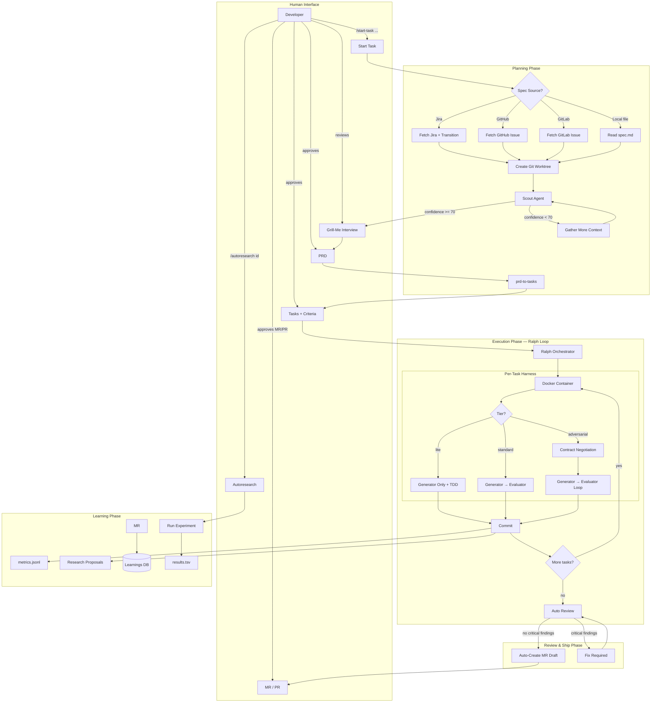

---

## Start Task — Spec Source Router

The `/start-task` command is **decoupled from any specific issue tracker**. It detects or asks where the spec comes from, fetches it, and normalizes into a common format for the rest of the pipeline.

### Usage

```bash
# Auto-detect source from argument format
/start-task APR-1234              # Jira (matches KEY-NUMBER pattern)
/start-task #42                   # GitHub/GitLab Issue (matches #NUMBER)
/start-task ./specs/feature.md    # Local file (matches file path)

# Explicit source
/start-task --jira APR-1234
/start-task --github 42
/start-task --gitlab 42
/start-task --file ./specs/feature.md

# No argument — interactive prompt
/start-task
> Where is your spec? (jira / github / gitlab / file): _
```

### Spec Source Detection

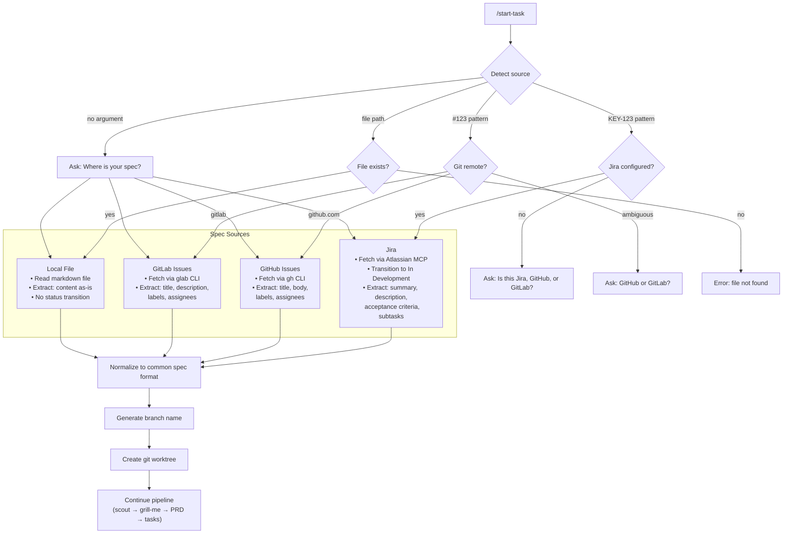

### Normalized Spec Format

Regardless of source, the spec is normalized into a common structure saved as `spec.json`:

```json
{
  "source": "jira",
  "source_id": "APR-1234",
  "source_url": "https://company.atlassian.net/browse/APR-1234",
  "title": "Implement JWT refresh token rotation",
  "description": "As a user, I want my session to stay alive...",
  "acceptance_criteria": [
    "Refresh token rotates on each use",
    "Old refresh tokens are invalidated",
    "Token rotation is atomic"
  ],
  "labels": ["security", "auth"],
  "assignee": "vinicius.rocha",
  "priority": "high",
  "raw": { /* original API response */ }
}
```

### Branch Name Generation

| Source | Input | Branch |
|--------|-------|--------|
| Jira | APR-1234 | `feat/APR-1234-jwt-refresh-rotation` |
| GitHub | #42 | `feat/gh-42-jwt-refresh-rotation` |
| GitLab | #42 | `feat/gl-42-jwt-refresh-rotation` |
| Local | spec.md | `feat/jwt-refresh-rotation` (from title) |

### Source-Specific Behavior

| Action | Jira | GitHub | GitLab | Local |
|--------|:---:|:---:|:---:|:---:|
| Fetch spec | Atlassian MCP | `gh issue view` | `glab issue view` | `Read file` |
| Transition status | In Development | — | — | — |
| Link MR/PR to issue | Comment on issue | Auto-link via branch | Auto-link via branch | — |
| Close on merge | Via transition | Auto-close (fixes #42) | Auto-close | — |

### Ship Phase — Also Decoupled

The review/ship phase adapts to the git remote:

| Remote | Action |
|--------|--------|
| `github.com` | `gh pr create` |
| GitLab (any) | `glab mr create` |
| No remote | Skip (local-only workflow) |

---

## Ralph Loop — Detailed Flow

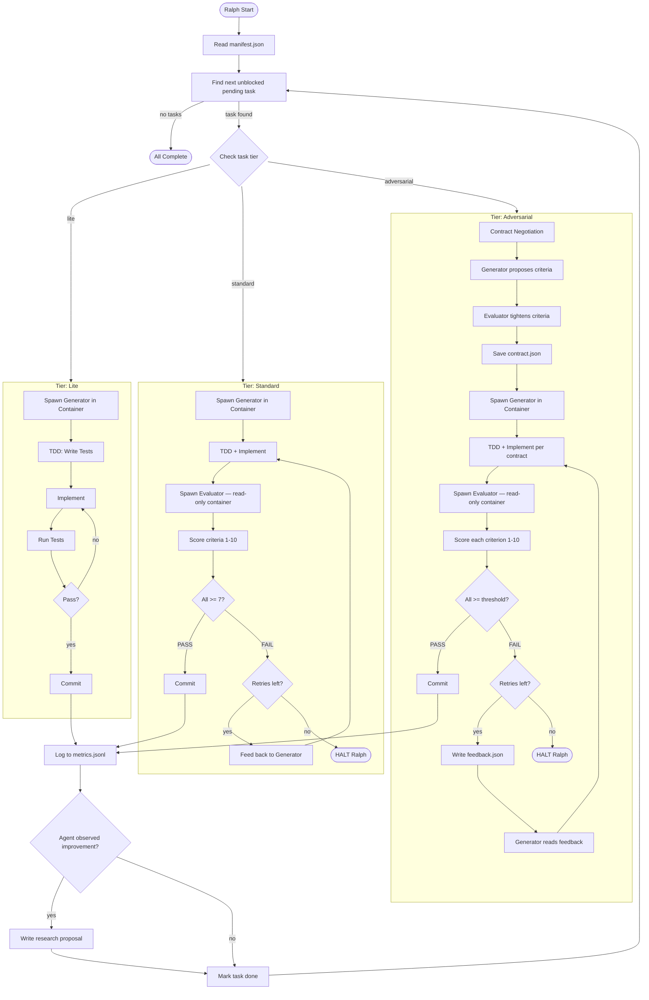

---

## Docker Container Isolation

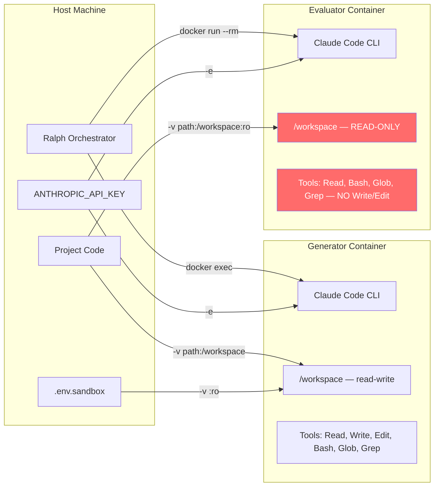

**Security boundaries:**

| What | Generator | Evaluator |
|------|:-:|:-:|
| Read project code | ✅ | ✅ |
| Write/edit code | ✅ | ❌ (`:ro` mount — kernel enforced) |
| Run tests | ✅ | ✅ |
| Access ~/.ssh, ~/.aws | ❌ | ❌ |
| Access production DB | ❌ (sanitized .env) | ❌ |
| Access internal network | ❌ (optional network isolation) | ❌ |
| Push to git | ❌ (no git config) | ❌ |

---

## Hook System — Mechanical Enforcement

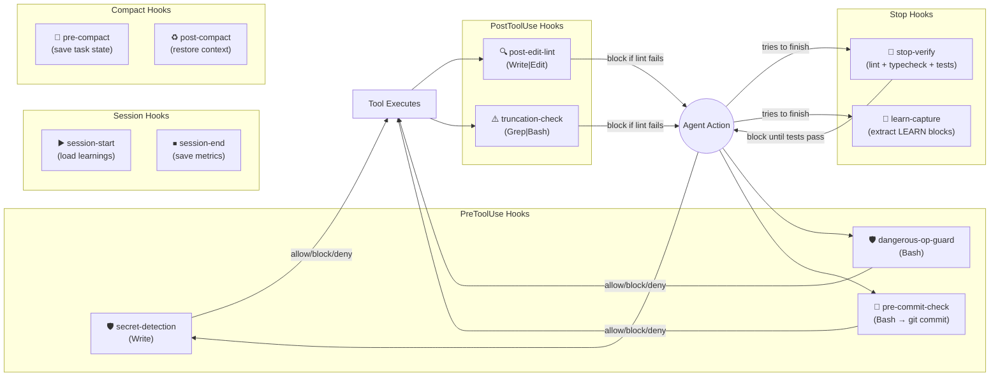

### Hook Registry

| # | Hook | Event | Matcher | Action | Timeout |
|---|------|-------|---------|--------|---------|
| 1 | `secret-detection.js` | PreToolUse | Write | **Block** if API keys/tokens found | 5s |
| 2 | `dangerous-op-guard.js` | PreToolUse | Bash | **Deny** rm -rf, SQL drops, .env reads, force push | 5s |
| 3 | `pre-commit-check.js` | PreToolUse | Bash | **Warn** if commit message not conventional format | 5s |
| 4 | `post-edit-lint.js` | PostToolUse | Write\|Edit | **Block** if linter fails on edited file | 120s |
| 5 | `truncation-check.js` | PostToolUse | Grep\|Bash | **Warn** if output was truncated | 5s |
| 6 | `stop-verify.js` | Stop | — | **Block** until typecheck + lint + tests pass | 300s |
| 7 | `learn-capture.js` | Stop | — | Extract [LEARN] blocks → save to DB | 5s |
| 8 | `session-start.js` | SessionStart | — | Load learnings from DB into context | 5s |
| 9 | `session-end.js` | SessionEnd | — | Save session metrics to DB | 5s |
| 10 | `pre-compact.js` | PreCompact | — | Save task state to compact-state.json | 5s |
| 11 | `post-compact.js` | PostCompact | — | Re-inject task state into context | 5s |

### How stop-verify prevents false "Done!"

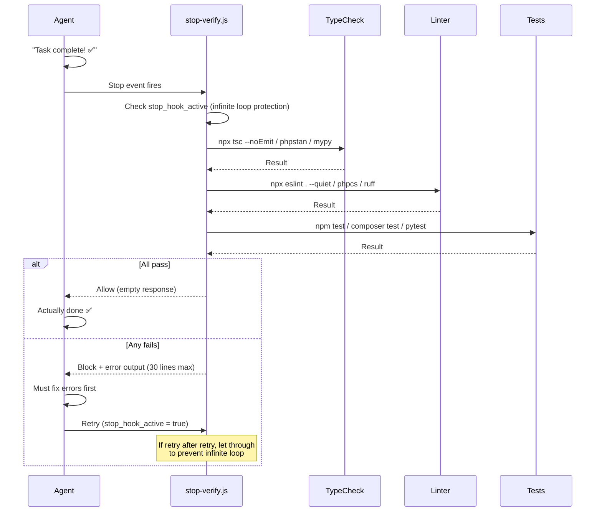

---

## Adversarial Evaluation — Generator vs Evaluator

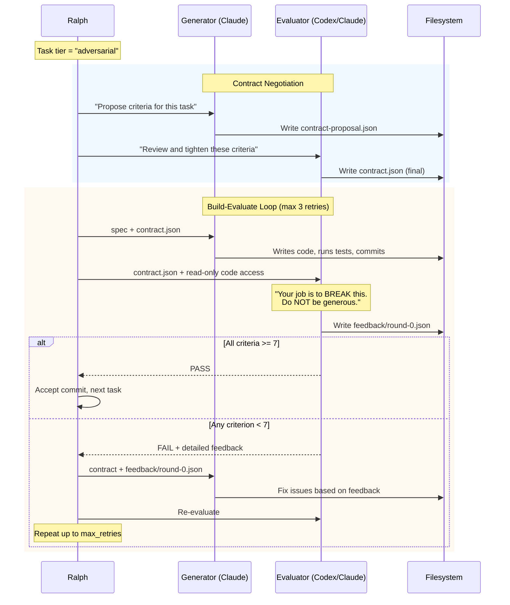

### Task Tier System

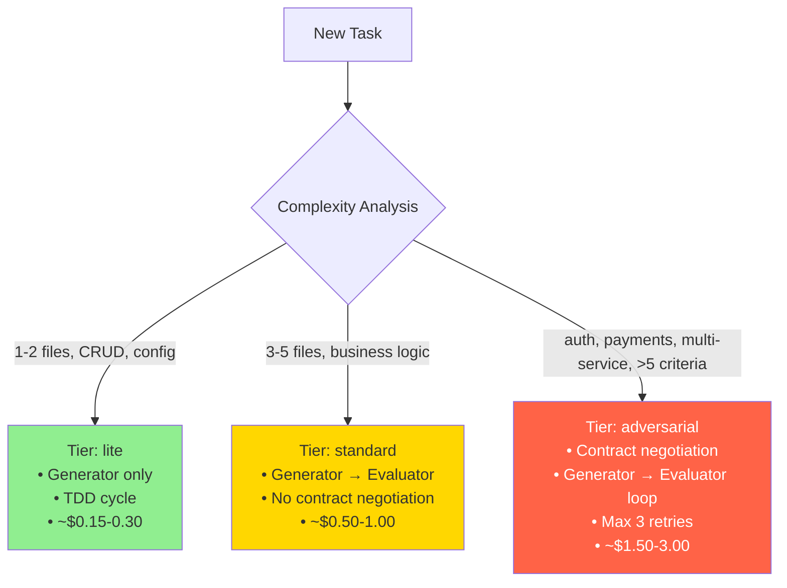

### Task Directory Structure (per task)

```
.local-development/tasks/{branch}/
├── manifest.json                    # Task list with order and dependencies
├── PROMPT.md                        # Instructions for ralph
├── progress.txt                     # Execution log
├── metrics.jsonl                    # Consolidated metrics
│
├── task-1/
│   ├── task.json                    # Definition + status + tier + criteria
│   ├── contract.json                # Negotiated criteria (if tier adversarial)
│   ├── feedback/
│   │   ├── round-0.json            # Evaluator feedback round 0
│   │   └── round-1.json            # Feedback after retry
│   ├── metrics.json                 # Cost, tokens, duration for this task
│   └── compact-state.json           # Saved context state (if compaction hit)
│
├── task-2/
│   ├── task.json
│   └── metrics.json                 # Tier lite: no contract/feedback
│
└── task-3/
    ├── task.json
    ├── contract.json
    ├── feedback/
    │   └── round-0.json
    └── metrics.json
```

---

## Learning System — Self-Correcting Memory

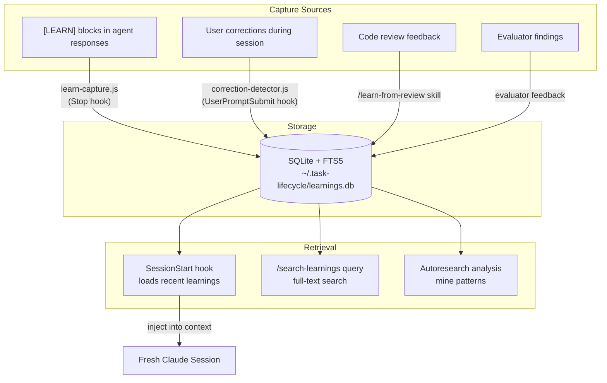

### Database Schema

```sql
-- Learnings: corrections, patterns, rules
CREATE TABLE learnings (
  id INTEGER PRIMARY KEY AUTOINCREMENT,
  project TEXT,
  category TEXT NOT NULL,        -- Navigation, Editing, Testing, Git, Quality, Architecture
  rule TEXT NOT NULL,             -- The actual rule/pattern
  mistake TEXT,                   -- What went wrong
  correction TEXT,                -- How it was fixed
  source TEXT DEFAULT 'manual',   -- manual, hook, review, evaluator
  session_id TEXT,
  created_at DATETIME DEFAULT CURRENT_TIMESTAMP
);

-- Full-text search index
CREATE VIRTUAL TABLE learnings_fts USING fts5(
  rule, mistake, correction, category, project,
  content='learnings', content_rowid='id'
);

-- Session metrics
CREATE TABLE sessions (
  id TEXT PRIMARY KEY,
  project TEXT,
  task_id TEXT,
  edits INTEGER DEFAULT 0,
  corrections INTEGER DEFAULT 0,
  prompts INTEGER DEFAULT 0,
  cost_usd REAL,
  tokens_total INTEGER,
  duration_ms INTEGER,
  started_at DATETIME DEFAULT CURRENT_TIMESTAMP,
  ended_at DATETIME
);
```

### Why SQLite? A Technical Defense

#### The Problem We're Solving

The learning system captures corrections, patterns, and rules during AI agent execution. These learnings must be:
1. **Writable at high frequency** — hooks fire on every edit, every stop, every correction (dozens per session)
2. **Searchable semantically** — "find all learnings about authentication" must search across rule text, mistake descriptions, and corrections simultaneously
3. **Filterable by project** — load only learnings relevant to the current codebase
4. **Persistent across sessions** — ralph spawns fresh Claude sessions per task; learnings must survive
5. **Shareable across team** — project-specific learnings must be committable to git

#### The Three Options Evaluated

##### Option A: JSON files (e.g., `learnings.json`)

```json
[
  {"category": "Architecture", "rule": "Use Bus facade for jobs", "mistake": "...", "correction": "..."},
  {"category": "Testing", "rule": "Seed DB before feature tests", "mistake": "...", "correction": "..."}
]
```

**How search would work:** Load entire file into memory, `Array.filter()` + `String.includes()` on every field.

| Aspect | Assessment |
|--------|-----------|
| Write speed | Fast for small files. **Degrades linearly** — must read entire file, parse, append, serialize, write back. At 500 learnings: ~50ms per write. At 5000: ~500ms |
| Search quality | **Keyword match only.** Searching "auth" won't find "authentication" or "JWT token rotation." No ranking — first match = best match |
| Concurrent writes | **Unsafe.** Two ralph-parallel sessions writing simultaneously = data loss (last write wins) |
| Git-friendly | ✅ Diffable, mergeable, human-readable |
| Dependencies | Zero |
| Memory | **Entire dataset loaded** on every read. At 5000 learnings with descriptions: ~2MB parsed into memory per session start |

##### Option B: Rule .mdc files (e.g., `rules/learning-auth-patterns.mdc`)

```markdown
---
description: Authentication patterns learned from past sessions
alwaysApply: true
---
- Use Bus facade for Laravel jobs, not static dispatch
- Always seed DB before feature tests
- JWT refresh tokens must rotate atomically
```

**How search would work:** Claude Code loads rules into context automatically. No programmatic search — the agent "searches" by reading its own context.

| Aspect | Assessment |
|--------|-----------|
| Write speed | Fast (append to file or create new file) |
| Search quality | **None.** Rules are loaded into agent context, but there's no search API. The agent can only "find" a learning if it happens to be in the currently loaded rules. With 500+ learnings across 50 rule files, context would be flooded |
| Context cost | **Catastrophic.** `alwaysApply: true` means ALL rules are injected into EVERY session. 500 learnings × ~100 tokens each = 50K tokens consumed before the agent does anything. That's 30% of usable context gone on learnings alone |
| Concurrent writes | Safe (separate files) |
| Git-friendly | ✅ Diffable, mergeable |
| Categorization | Manual — must decide which file gets each learning |
| Deduplication | **None.** Same pattern captured twice = two entries forever |

##### Option C: SQLite with FTS5 (our choice)

```sql
-- Write: one INSERT, microseconds
INSERT INTO learnings (project, category, rule, mistake, correction, source)
VALUES ('gateway-api', 'Architecture', 'Use Bus facade for jobs', '...', '...', 'hook');

-- Search: full-text across ALL fields, ranked by relevance
SELECT * FROM learnings_fts WHERE learnings_fts MATCH 'authentication token'
ORDER BY rank LIMIT 5;
```

| Aspect | Assessment |
|--------|-----------|
| Write speed | **Microseconds.** SQLite handles thousands of writes per second. No serialization overhead |
| Search quality | **Full-text search with ranking.** FTS5 tokenizes text, builds inverted index, supports phrase queries, prefix queries, boolean operators. "auth" finds "authentication," "authorize," "auth-middleware" |
| Concurrent writes | **Safe.** SQLite handles concurrent reads + serialized writes with WAL mode. Ralph-parallel sessions won't conflict |
| Context cost | **Minimal.** `session-start.js` loads only top 5 relevant learnings per project (~500 tokens). Not all 5000 |
| Git-friendly | ❌ Binary file — not diffable. **Solved by dual-store: JSON export for git, DB for runtime** |
| Dependencies | **Zero external deps.** `bun:sqlite` is built into Bun. No npm install, no native binaries, no compilation |
| Memory | **Only query results loaded.** DB stays on disk; only the 5 results enter memory |
| Deduplication | Trivial — `SELECT COUNT(*) WHERE rule = ?` before insert |

#### Comparative Summary

```
                    JSON files    .mdc rules    SQLite + FTS5
                    ──────────    ──────────    ─────────────
Write speed (500)   ~50ms         ~1ms          ~0.1ms
Write speed (5000)  ~500ms        ~1ms          ~0.1ms
Search quality      keyword       none          full-text ranked
Context cost        load all      load ALL      load top 5
Concurrent safe     ❌            ✅            ✅
Git diffable        ✅            ✅            ❌ (solved by JSON export)
Dependencies        0             0             0 (bun built-in)
Deduplication       manual        none          trivial
```

#### What is FTS5?

FTS5 (Full-Text Search 5) is a SQLite extension that creates a **search engine inside the database**. It's the same technology behind search in: iOS Spotlight, Firefox history, Fossil (SQLite's own version control), and thousands of embedded applications.

How it works:

```
1. On INSERT: FTS5 tokenizes the text
   "Use Bus facade for Laravel jobs" → ["use", "bus", "facade", "laravel", "jobs"]

2. Builds an inverted index (like Google, but local):
   "bus"      → [learning #1, learning #47]
   "facade"   → [learning #1, learning #23, learning #89]
   "laravel"  → [learning #1, learning #5, learning #12, ...]

3. On SEARCH: looks up tokens in the index
   MATCH 'laravel job' → finds intersection of "laravel" + "job" entries
   Returns results RANKED by relevance (BM25 algorithm — same as Elasticsearch)

4. Performance: O(1) lookup per token, regardless of dataset size
   10 learnings or 10,000: same search speed (~0.1ms)
```

Example queries:

```sql
-- Simple: find anything mentioning authentication
SELECT * FROM learnings_fts WHERE learnings_fts MATCH 'authentication';

-- Phrase: exact phrase match
SELECT * FROM learnings_fts WHERE learnings_fts MATCH '"refresh token"';

-- Prefix: match words starting with "auth"
SELECT * FROM learnings_fts WHERE learnings_fts MATCH 'auth*';

-- Boolean: must have "laravel", must not have "testing"
SELECT * FROM learnings_fts WHERE learnings_fts MATCH 'laravel NOT testing';

-- Column-specific: only search in the "rule" field
SELECT * FROM learnings_fts WHERE learnings_fts MATCH 'rule:facade';

-- Ranked: most relevant first (BM25 scoring)
SELECT *, rank FROM learnings_fts WHERE learnings_fts MATCH 'queue dispatch'
ORDER BY rank;
```

#### The Dual-Store Solution

The one weakness of SQLite (not git-diffable) is solved by maintaining both formats:

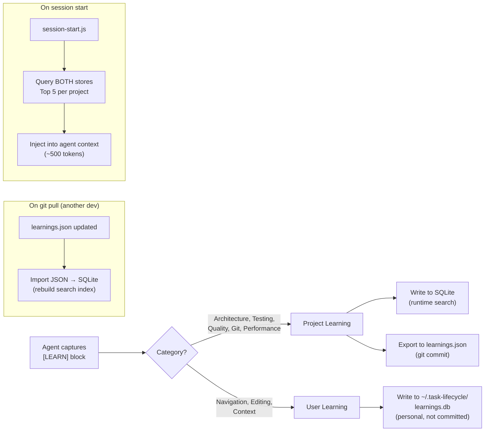

- **SQLite** = runtime engine (fast writes, ranked search, concurrent-safe)
- **JSON** = persistence format for git (diffable, mergeable, human-reviewable in PRs)
- **`.mdc` rules** = reserved for static, hand-curated conventions (not auto-captured learnings)

#### Why Not Just Use .mdc Rules for Everything?

The critical argument: **rules consume context unconditionally.**

Every `.mdc` file with `alwaysApply: true` is injected into every session. This is correct for 5-10 hand-curated architectural rules. It is catastrophic for 500+ auto-captured learnings:

```
Context window: ~200K tokens
System prompt + tools: ~30K tokens
CLAUDE.md: ~5K tokens
10 rules (.mdc): ~2K tokens          ← this is fine
500 learnings (.mdc): ~50K tokens     ← this kills 25% of usable context
─────────────────────────────────
Available for actual work: ~113K vs ~163K

That 50K difference = ~3 fewer files the agent can read before compaction fires.
```

SQLite + `session-start.js` loads **only the 5 most relevant learnings** for the current project. Cost: ~500 tokens. The other 495 learnings exist in the DB, searchable on demand via `/search-learnings`, but they don't consume context unless needed.

#### Addressing Common Concerns

**"SQLite is a database — isn't that overkill?"**

SQLite is a single file. No server, no daemon, no port, no connection string. It's a library linked into Bun at compile time (`bun:sqlite`). Creating and querying a SQLite database is literally 3 lines of code:

```javascript
import { Database } from "bun:sqlite";
const db = new Database("learnings.db");
const results = db.query("SELECT * FROM learnings_fts WHERE learnings_fts MATCH ?").all("auth");
```

There is no installation step. No `docker-compose`. No migration tool. The DB file is created on first run. If you delete it, it's rebuilt from `learnings.json` on next session start.

**"What if SQLite has issues / gets corrupted?"**

The JSON export is the source of truth for project learnings. If the DB is corrupted or deleted:
1. `session-start.js` detects DB is missing
2. Reads `learnings.json`
3. Rebuilds DB + FTS5 index
4. Continues normally

The DB is a **cache** of the JSON, not the other way around.

**"Can't we just grep JSON files?"**

You can. For 50 learnings, grep works fine. The question is what happens at 500:

```bash
# Searching "authentication" across all learnings
# JSON: load 500 entries, scan each field → ~50ms, keyword match only
# FTS5: index lookup → ~0.1ms, ranked results, partial match
```

The difference is invisible for 50 entries. At 500+, with a session-start hook that fires on every `claude -p` invocation (dozens per ralph run), the cumulative cost matters.

**"This adds complexity to the plugin."**

The entire database module is **one file** (`learnings-db.js`, ~150 lines). It exports 6 functions. Every hook that touches learnings calls one function. If SQLite were removed tomorrow, the fallback is: change 6 function calls to read/write JSON. The abstraction boundary is clean.

---

## Autoresearch — Self-Improving Workflow

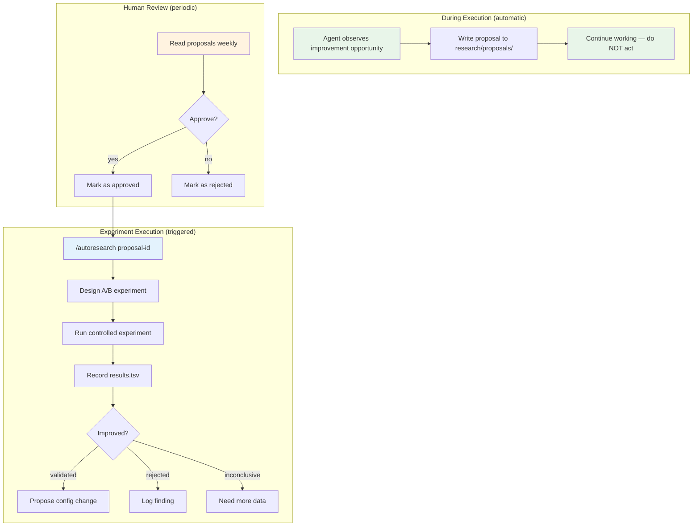

### Two Research Scopes

| Scope | Directory | Applies to | Examples |
|-------|-----------|------------|---------|
| **Workflow** | `~/.agents/research/workflow/` | All projects | Model selection, token efficiency, agent specialization |
| **Project** | `{project}/.local-development/research/` | Specific codebase | Test partitioning, framework patterns, API design |

### Annotation Categories

| Category | Question | Metric |
|----------|----------|--------|
| Model Selection | Which model + effort per phase? | cost/task, quality score, retry rate |
| Token Efficiency | Where are tokens wasted? | tokens/phase, cost ratio |
| Skill Improvement | Which skills produce suboptimal output? | correction rate, rework frequency |
| Agent Specialization | Generalist vs domain-specific? | first-pass quality, review findings |
| Parallelism | Sequential vs parallel? | wall-clock time, total tokens |
| Quality Gates | Real bugs vs noise? | true/false positive rate |
| Developer Experience | Where does human spend unnecessary time? | time-to-approve, rejection rate |
| Local/Free Models | Can Gemma 3/Llama replace API calls? | agreement rate, latency |

---

## Context Compaction — State Preservation

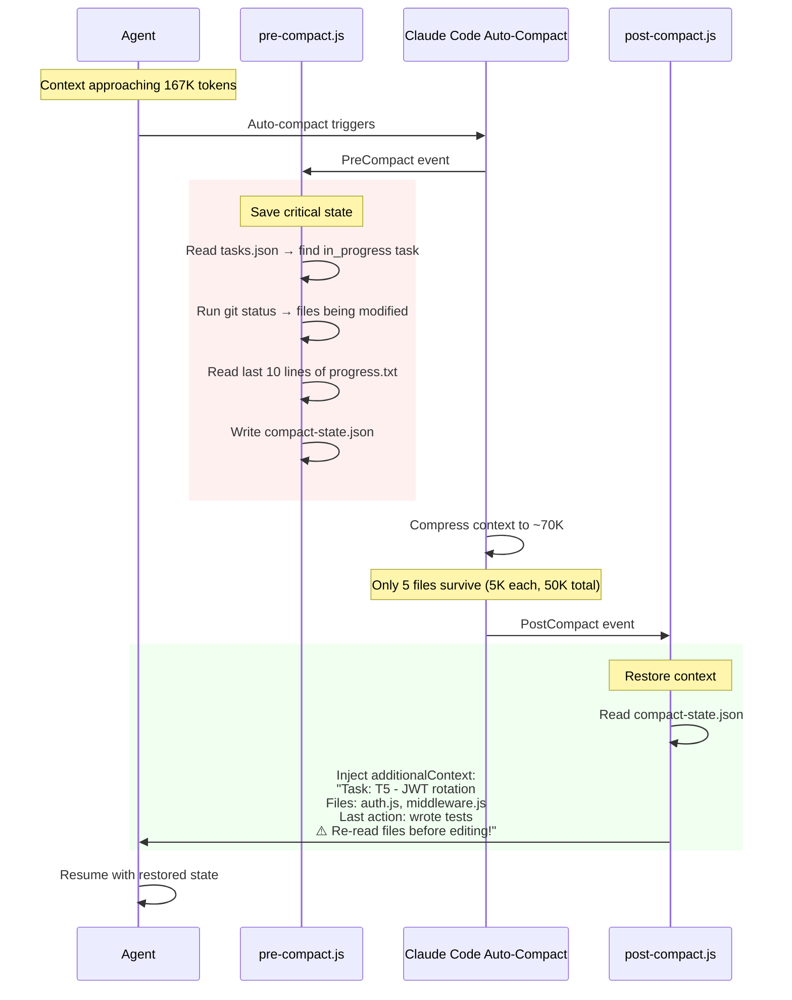

### Prevention Strategies (ralph-execution.mdc)

| Strategy | Token Savings | When to Use |
|----------|:---:|-------------|
| Read with offset/limit | 50-90% per read | Files > 500 LOC |
| Delegate grep to subagent | 30-60% per search | Broad searches |
| Summarize test output | 70-90% | After test runs |
| Write checkpoints to progress.txt | N/A (recovery) | Before heavy operations |
| Compact at task boundaries | Full reset | Between tasks (ralph handles this) |

---

## Behavioral Rules (.mdc files)

### agent-quality-standards.mdc (always active)

Applied to every session — interactive and ralph:

- **Verification**: Forbidden from claiming "Done!" until lint + typecheck + tests pass
- **Edit safety**: Re-read file before AND after every edit. Max 3 edits per file without verification read
- **Rename safety**: 6 separate grep patterns (calls, types, strings, dynamic imports, re-exports, mocks)
- **Context awareness**: Chunked reads for files > 500 LOC. Truncation awareness for results > 50K chars
- **Code quality**: Override "simplest approach" bias. Fix architectural flaws, not just symptoms
- **Self-correction**: 2 failed attempts → stop and re-think. Log corrections with [LEARN]
- **Compaction awareness**: Auto-compact fires at ~167K. Only 5 files survive. Write checkpoints

### ralph-execution.mdc (ralph sessions only)

Applied only during ralph loop execution:

- **Task boundaries**: One task per session. Follow contract criteria exactly
- **TDD cycle**: Tests first → must fail → implement → must pass
- **Research annotations**: Annotate improvement observations, don't act on them
- **Commit discipline**: Conventional format, task ID in scope
- **Context discipline**: Offset/limit reads, summarize test output, checkpoint before heavy ops

---

## Permission Template

```json
{
  "permissions": {
    "deny": [
      "Bash(rm -rf *)",
      "Bash(curl * | bash)",
      "Bash(wget * | sh)",
      "Edit(/vendor/**)",
      "Edit(/node_modules/**)"
    ],
    "ask": [
      "Bash(git push *)",
      "Bash(git reset *)",
      "Bash(docker *)",
      "Bash(npm publish *)"
    ],
    "allow": [
      "Read", "Glob", "Grep", "Edit", "Write",
      "Bash(npm test *)", "Bash(npm run lint *)", "Bash(npx tsc *)",
      "Bash(composer test *)", "Bash(php artisan test *)",
      "Bash(git status)", "Bash(git diff *)", "Bash(git log *)",
      "Bash(git branch *)", "Bash(git checkout *)",
      "Bash(git add *)", "Bash(git commit *)",
      "Agent", "Task*"
    ]
  }
}
```

---

## Complete Component Inventory

### Skills (22)

| Skill | Phase | Purpose |
|-------|-------|---------|
| setup-task-lifecycle | Setup | Interactive project configuration |
| start-task | Start | Detect spec source (Jira/GitHub/GitLab/file), fetch, normalize, create worktree |
| grill-me | Discovery | Stress-test requirements interview |
| write-a-prd | Planning | Create PRD from interview + codebase |
| prd-to-tasks | Planning | Break PRD into tasks with tiers + criteria |
| test-driven-execution | Execution | TDD cycle enforcement |
| verification-before-completion | Execution | Quality gate checklist |
| systematic-debugging | Execution | Structured bug investigation |
| review-pr | Review | 5-phase automated code review |
| post-review | Review | Post review to GitLab MR |
| learn-from-review | Learning | Save patterns as persistent rules |
| git-worktrees | Infrastructure | Manage isolated worktrees |
| dev-stack | Infrastructure | Docker dev environment |
| gitlab-mr-cli | Ship | Create MR via glab CLI (GitLab remotes) |
| session-evaluation | Metrics | Score completed session 0-100 |
| task-flow-report | Metrics | Cross-session benchmarking |
| conventional-commits | Git | Conventional commit formatting |
| autoresearch | Research | Run controlled experiments |
| learn | Learning | Manual learning capture |
| search-learnings | Learning | Full-text search past learnings |
| wrap-up | Session | End-of-session ritual |
| doctor | Health | Verify plugin installation |

### Scripts (8)

| Script | Purpose |
|--------|---------|
| ralph.js | Sequential autonomous task executor |
| ralph-parallel.js | Parallel autonomous task executor |
| evaluator.js | Spawn adversarial evaluator session |
| contract-negotiation.js | Pre-implementation criteria negotiation |
| learnings-db.js | SQLite + FTS5 learning store |
| research-summary.js | Post-ralph research summary generator |
| task-flow-report.js | Session analysis and benchmarking |
| dev-stack.js | Docker dev environment manager |

### Hooks (11)

| Hook | Event | Purpose |
|------|-------|---------|
| secret-detection.js | PreToolUse(Write) | Block hardcoded secrets |
| dangerous-op-guard.js | PreToolUse(Bash) | Block destructive commands |
| pre-commit-check.js | PreToolUse(Bash) | Validate commit format |
| post-edit-lint.js | PostToolUse(Write\|Edit) | Per-edit linting |
| truncation-check.js | PostToolUse(Grep\|Bash) | Truncation warnings |
| stop-verify.js | Stop | Block "Done!" until verification passes |
| learn-capture.js | Stop | Auto-extract [LEARN] blocks |
| session-start.js | SessionStart | Load learnings into context |
| session-end.js | SessionEnd | Save session metrics |
| pre-compact.js | PreCompact | Save task state before compaction |
| post-compact.js | PostCompact | Restore context after compaction |

### Rules (2)

| Rule | Scope | Purpose |
|------|-------|---------|
| agent-quality-standards.mdc | Always active | Verification, edit safety, code quality |
| ralph-execution.mdc | Ralph sessions | TDD, task boundaries, context discipline |

### Database (1)

| Component | Location | Purpose |
|-----------|----------|---------|
| learnings.db | ~/.task-lifecycle/ | SQLite + FTS5 for learnings + session metrics |

---

## Human Touchpoints

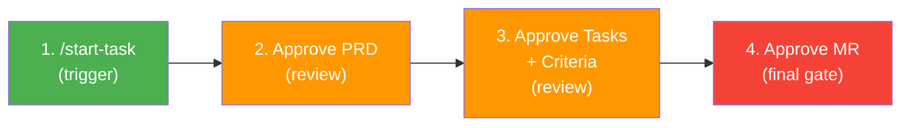

**Everything between touchpoints is autonomous:**
- Scout explores codebase in background
- Ralph executes tasks with TDD
- Evaluator verifies adversarially
- Hooks enforce quality mechanically
- Learnings persist automatically
- Research proposals written silently

---

## Installation

```bash
# Install the plugin
/plugin install vsr-skills@task-lifecycle

# Configure for your project
/setup-task-lifecycle

# Start working — any spec source
/start-task APR-1234              # from Jira
/start-task #42                   # from GitHub/GitLab issue
/start-task ./specs/feature.md    # from local file
/start-task                       # interactive — asks where the spec is
```
